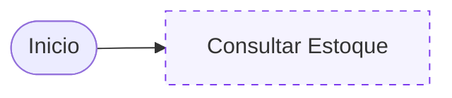

# flowbridge

[](https://github.com/raywall/flowbridge)
[](https://github.com/raywall/flowbridge)
[](https://github.com/raywall/flowbridge)

O `flowbridge` é um visualizador embutido para diagramas Mermaid distribuídos.

Ele permite que uma página de documentação carregue um arquivo `.mmd`, renderize o diagrama na própria página e navegue para diagramas de outros times a partir de links declarados no próprio Mermaid.

A ideia é simples: cada time publica seus fluxos funcionais como arquivos `.mmd`. Quando um fluxo depende de outro serviço, o nó do diagrama aponta para o `.mmd` desse serviço. O usuário clica no nó e o `flowbridge` substitui a visualização atual pelo diagrama referenciado, mantendo a navegação fluida.

## O que o projeto resolve

Em sistemas distribuídos, a documentação de um fluxo funcional raramente vive em um único repositório. Um fluxo de vendas pode depender de estoque, pagamento e entrega, cada um mantido por um time diferente.

Com o `flowbridge`, cada time continua dono do seu diagrama, mas os fluxos são conectados:
* Diagramas carregados dinamicamente de arquivos `.mmd`.
* Links externos declarados com `click NODE "ext:URL"`.
* Botões de Reset, Expandir e Download integrados.
* Tooltips com metadados técnicos (SLA, Owner, Alertas).
* Suporte a Zoom, Arraste e Ícones (AWS e Font Awesome).

## Estrutura do Projeto

```text
flowbridge/
├── app/shared/          # Core do plugin (JS, CSS, Ícones)
├── obsidian/            # Código-fonte do plugin para Obsidian
├── src/                 # Scripts de apoio e servidor de exemplo
├── dist/                # Build final para o Obsidian
└── Makefile             # Automação de tarefas
```

## Como declarar um diagrama (.mmd)

Crie um arquivo Mermaid padrão e use comentários especiais para metadados:



## Implementação em HTML/JavaScript

Inclua as dependências e inicialize o viewer:

```html
<link rel="stylesheet" href="flowbridge.css" />
<script src="aws-icons.js"></script>
<script src="flowbridge.js"></script>

<div id="viewer"></div>

<script>
  const viewer = new window.Flowbridge.Viewer({
    element: document.getElementById("viewer"),
    initialSrc: "https://sua-url.com/fluxo.mmd",
    height: 520,
  });
  viewer.start();
</script>
```

## Implementação no Docusaurus (React/MDX)

Para o Docusaurus, utilize o componente abaixo para evitar problemas de SSR:

### 1. Configuração (`docusaurus.config.js`)
```javascript
export default {
  stylesheets: ['/css/flowbridge.css'],
  scripts: ['/js/aws-icons.js', '/js/flowbridge.js'],
  headTags: [{
    tagName: 'script',
    attributes: { type: 'module' },
    innerHTML: `import mermaid from "https://cdn.jsdelivr.net/npm/mermaid@11/dist/mermaid.esm.min.mjs"; window.mermaid = mermaid;`,
  }],
};
```

### 2. Componente (`src/components/FlowbridgeViewer/index.js`)
```jsx
import React, { useEffect, useRef } from 'react';
import BrowserOnly from '@docusaurus/BrowserOnly';

export default function FlowbridgeViewer({ src, height = 520 }) {
  return (
    <BrowserOnly fallback={<div>Carregando...</div>}>
      {() => {
        const containerRef = useRef(null);
        useEffect(() => {
          async function bootstrap() {
            while (!window.mermaid || !window.Flowbridge) await new Promise(r => setTimeout(r, 50));
            if (containerRef.current) {
              new window.Flowbridge.Viewer({ element: containerRef.current, initialSrc: src, height }).start();
            }
          }
          bootstrap();
        }, [src]);
        return <div ref={containerRef} style={{ minHeight: height }}></div>;
      }}
    </BrowserOnly>
  );
}
```

## Plugin para Obsidian

O `flowbridge` também funciona como plugin para o Obsidian.
1. Compile com `make build`.
2. Use blocos de código `flowbridge` em suas notas:
   ```flowbridge
   src: diagrams/vendas.mmd
   height: 500
   ```

## Monitoramento (Datadog)

O servidor de exemplo (`server.py`) envia métricas via DogStatsD automaticamente:
* `flowbridge.server.up`
* `flowbridge.http.requests`
* `flowbridge.http.request.duration`

## Licença

Distribuído sob a licença MIT. Veja `LICENSE` para mais informações.
