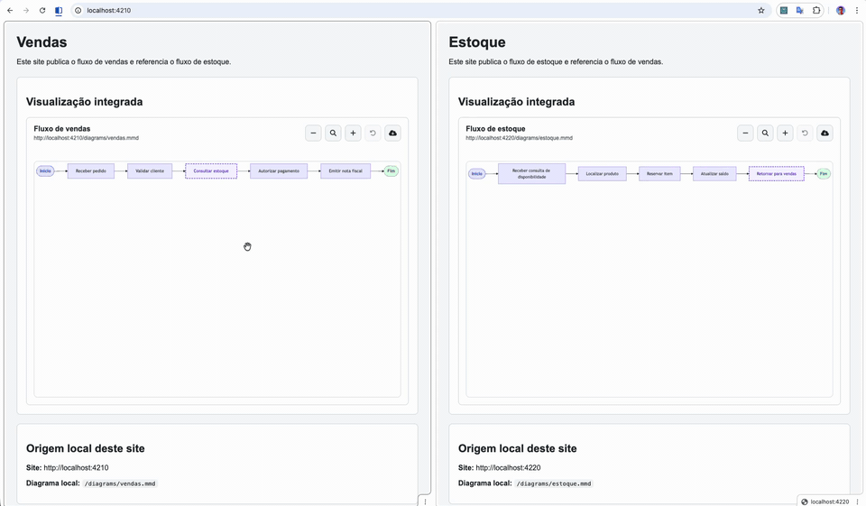
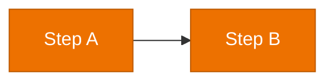
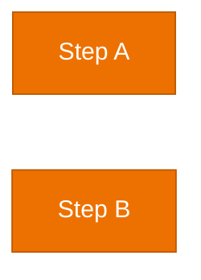

# flowbridge


`flowbridge` é um visualizador embutido para diagramas Mermaid distribuídos.

Ele permite que uma página de documentação carregue um arquivo `.mmd`, renderize o diagrama na própria página e navegue para diagramas de outros times a partir de links declarados no próprio Mermaid.

A ideia é simples: cada time publica seus fluxos funcionais como arquivos `.mmd` no seu GitHub Pages, portal de docs ou site estático. Quando um fluxo depende de outro serviço, o nó do diagrama aponta para o `.mmd` desse outro serviço. O usuário clica no nó e o `flowbridge` substitui a visualização atual pelo diagrama referenciado, mantendo a opção de resetar a visualização para o diagrama original da página.



## O que o projeto resolve

Em sistemas distribuídos, a documentação de um fluxo funcional raramente vive em um único repositório. Um fluxo de vendas pode depender de estoque, pagamento, entrega, faturamento e outros serviços, cada um mantido por um time diferente.

Com `flowbridge`, cada time continua dono do seu diagrama, mas os fluxos podem ser conectados em uma experiência única de navegação:

- o diagrama inicial é carregado de um arquivo `.mmd`;
- links externos são declarados com `click NODE "ext:URL"`;
- ao clicar em um nó externo, o diagrama de destino é carregado no mesmo viewer;
- o botão de reset retorna ao diagrama original da página e à posição inicial;
- o botão de expandir abre o desenho em um popup maior, mantendo zoom, arraste e navegação por clique;
- o botão de download baixa o `.mmd` exibido;
- a roda do mouse aproxima ou reduz o desenho, e o arraste move a visualização.

## Estrutura do exemplo

```txt
flowbridge/
├── app/
│   ├── shared/
│   │   ├── aws-icons.js
│   │   ├── flowbridge.css
│   │   └── flowbridge.js
│   ├── vendas/
│   │   ├── diagrams/
│   │   │   └── vendas.mmd
│   │   ├── index.html
│   │   └── styles.css
│   └── estoque/
│       ├── diagrams/
│       │   └── estoque.mmd
│       ├── index.html
│       └── styles.css
├── src/
│   ├── generate-aws-icons.js
│   └── server.py
├── obsidian/
│   ├── src/
│   ├── manifest.json
│   ├── package.json
│   └── styles.css
├── dist/
│   ├── main.js
│   ├── manifest.json
│   └── styles.css
├── Makefile
└── README.md
```

No exemplo local:

- `http://localhost:4200` serve o plugin `flowbridge.js` e seus estilos `flowbridge.css`;
- `http://localhost:4210` serve a documentação de vendas;
- `http://localhost:4220` serve a documentação de estoque.

## Como executar localmente

Na raiz do projeto:

```bash
make start
```

Depois acesse:

```txt
http://localhost:4210
http://localhost:4220
```

Para encerrar os servidores:

```bash
make stop
```

Também é possível subir cada parte separadamente:

```bash
make shared
make vendas
make estoque
```

## Flowbridge para Obsidian

Além do viewer para sites estáticos, o projeto também inclui uma versão do `flowbridge` como plugin para Obsidian.

O código-fonte do plugin fica em `obsidian/` e o build gera a pasta `dist/` na raiz do projeto com os arquivos esperados pelo Obsidian:

```txt
dist/
├── main.js
├── manifest.json
└── styles.css
```

Para compilar:

```bash
make build
```

Dentro de uma nota do Obsidian, use um bloco `flowbridge` apontando para um arquivo `.mmd` do vault:

````markdown
```flowbridge
src: diagrams/vendas.mmd
height: 520
theme: default
```
````

Também é possível escrever o Mermaid diretamente dentro do bloco. Nesse modo, `src` não é obrigatório:

````markdown
```flowbridge
height: 520
theme: default

%% title: Fluxo de vendas
flowchart LR
  start([Inicio]):::start
  receive[Receber pedido]
  finish([Fim]):::success

  start --> receive --> finish

  %% @tooltip receive
  %%   title: Receber Pedido
  %%   description: Normaliza o payload recebido pelo canal de venda.
  %%   owner: time-vendas
  %% @end

  classDef start fill:#dbeafe,stroke:#2563eb,color:#1e40af,font-weight:bold
  classDef success fill:#dcfce7,stroke:#16a34a,color:#166534,font-weight:bold
```
````

O plugin renderiza o Mermaid no Obsidian, mantém navegação por links `ext:`, tooltips declarados com `%% @tooltip`, zoom, arraste, reset, voltar e download do `.mmd` exibido.

Links `ext:` para outros arquivos do vault navegam dentro do próprio viewer. Links HTTP/HTTPS abrem em uma nova aba.

## Monitoramento com Datadog

O `src/server.py` já envia métricas para o Datadog Agent usando DogStatsD, sem precisar instalar uma biblioteca Python extra. Cada processo recebe um `service` próprio:

- `localhost:4200`: `flowbridge-shared`;
- `localhost:4210`: `flowbridge-vendas`;
- `localhost:4220`: `flowbridge-estoque`.

Com o Datadog Agent local rodando e o DogStatsD habilitado em `localhost:8125`, basta iniciar normalmente. O `Makefile` já define `DD_ENV=local`, `DD_AGENT_HOST=127.0.0.1`, `DD_DOGSTATSD_PORT=8125`, `DD_METRICS_ENABLED=1`, `DD_LOGS_JSON=0` e `DD_VERSION=dev`:

```bash
make start
```

As métricas enviadas são:

```txt
flowbridge.server.up
flowbridge.http.requests
flowbridge.http.request.duration
```

Todas recebem tags como `service`, `env`, `port`, `directory`, `method`, `status_code` e `status_family`, o que permite filtrar separadamente `4200`, `4210` e `4220` no Datadog.

Se o Agent estiver em outro host ou porta:

```bash
make start DD_AGENT_HOST=127.0.0.1 DD_DOGSTATSD_PORT=8125 DD_ENV=local
```

Para logs estruturados em JSON, ative:

```bash
make start DD_LOGS_JSON=1 DD_ENV=local
```

Em execução local, o Datadog Agent não coleta automaticamente o stdout de um processo fora de container. Uma opção simples é redirecionar a saída para um arquivo:

```bash
mkdir -p logs
make start DD_LOGS_JSON=1 DD_ENV=local > logs/flowbridge.log 2>&1
```

Depois configure o Agent para coletar esse arquivo, por exemplo em `conf.d/flowbridge.d/conf.yaml`:

```yaml
logs:
  - type: file
    path: /caminho/absoluto/para/flowbridge/logs/flowbridge.log
    service: flowbridge
    source: python
```

## Como declarar um diagrama

Crie um arquivo `.mmd` no site do time:

```mermaid
%% title: Fluxo de vendas
flowchart LR
  start([Inicio]):::start
  receive[Receber pedido]
  stock[Consultar estoque]:::external
  finish([Fim]):::success

  start --> receive --> stock --> finish

  click stock "ext:http://localhost:4220/diagrams/estoque.mmd" "Abrir fluxo de estoque"

  %% @tooltip receive
  %%   title: Receber Pedido
  %%   description: Valida o payload de entrada e normaliza o contrato antes de prosseguir.
  %%   owner: time-vendas
  %%   sla: < 200ms
  %%   since: 2024-01
  %%   tags: entrada, critico
  %%   link: Runbook | https://wiki.empresa.com/vendas/receber
  %% @end

  %% @tooltip stock
  %%   title: Consultar Estoque
  %%   description: Chamada sincrona com timeout de 3s e fallback para cache Redis.
  %%   owner: time-estoque
  %%   sla: p99 < 500ms
  %%   alert: Degradacao historica as sextas apos 18h
  %%   tags: externo, dependencia
  %%   link: Diagrama de estoque | ext:http://localhost:4220/diagrams/estoque.mmd
  %%   link: Dashboard          | https://datadog.empresa.com/estoque
  %% @end

  classDef start fill:#dbeafe,stroke:#2563eb,color:#1e40af,font-weight:bold
  classDef success fill:#dcfce7,stroke:#16a34a,color:#166534,font-weight:bold
  classDef external fill:#f5f3ff,stroke:#7c3aed,color:#5b21b6,stroke-dasharray:6 3,stroke-width:2px
```



O comentário `%% title: ...` é opcional, mas recomendado. O viewer usa esse valor como título do diagrama.

O prefixo `ext:` indica que aquele link deve ser tratado pelo `flowbridge`. Em vez de abrir outra aba ou um popup, o viewer carrega o diagrama referenciado dentro da mesma área da página.

### Ícones por classe

O `flowbridge` pode aplicar um ícone em todos os nodes que usam uma classe. Assim o `.mmd` fica mais limpo e você não precisa repetir o mesmo prefixo em cada step.

Declare a regra em um comentário Mermaid:



Ao renderizar, o viewer identifica os nodes com a classe `lambda` e injeta o ícone no SVG exibido.

No plugin do Obsidian, os ícones são renderizados com os SVGs oficiais dos pacotes gratuitos do Font Awesome: solid (`fa:` ou `fas:`), regular (`far:`) e brands (`fab:`). No viewer web, o Flowbridge usa a instância global do Font Awesome quando ela está disponível na página.

Para ícones da AWS, o Flowbridge usa um pacote local gerado a partir dos SVGs em `aws-icons/`. Isso evita depender de um serviço externo e funciona no viewer web e no plugin do Obsidian. Você pode usar o prefixo explícito `aws:` ou manter o padrão `fa:fa-*`; quando o ícone não existe no Font Awesome, o Flowbridge tenta encontrar um equivalente no pacote da AWS.

Os ícones da AWS são gerados sem o fundo original do SVG. O símbolo usa `currentColor`, então ele herda a cor definida no `color` do `classDef`, enquanto o fundo do node continua sendo o `fill` do próprio `classDef`.

O arquivo original não é alterado e o download continua entregando o `.mmd` como ele foi escrito.

Também funciona com declaração de classe separada:



Exemplos:

```mermaid
%% flowbridge:classIcon lambda fa:fa-terminal
%% flowbridge:classIcon vehicle fa:fa-car
%% flowbridge:classIcon repo fab:fa-github
%% flowbridge:classIcon note far:fa-note-sticky
%% flowbridge:classIcon lambda fa:fa-lambda
%% flowbridge:classIcon container fa:fa-ecs
%% flowbridge:classIcon queue aws:sqs
```

Para atualizar o pacote local de ícones da AWS, substitua ou adicione os SVGs em `aws-icons/` e rode:

```bash
node src/generate-aws-icons.js
```

Esse comando atualiza `app/shared/aws-icons.js`, usado em páginas web, e `obsidian/src/aws-icons.generated.ts`, usado no plugin do Obsidian.

### Tooltips e anotações

O `flowbridge` também lê comentários Mermaid para exibir detalhes ao passar o mouse ou focar um node.

Use `@tooltip` para declarar metadados separados por node:

```mermaid
%% @tooltip receive
%%   title: Receber Pedido
%%   description: Valida o payload de entrada e normaliza o contrato antes de prosseguir.
%%   owner: time-vendas
%%   sla: < 200ms
%%   since: 2024-01
%%   tags: entrada, critico
%%   link: Runbook | https://wiki.empresa.com/vendas/receber
%% @end
```

Campos comuns como `owner`, `sla`, `since`, `tags` e `alert` aparecem como atributos estruturados. O campo `description` vira o texto principal.

Você pode declarar mais de um `link`. Links com `ext:` navegam pelo próprio `flowbridge`; links HTTP/HTTPS abrem em outra aba.

```mermaid
%% @tooltip stock
%%   title: Consultar Estoque
%%   description: Chamada sincrona com timeout de 3s e fallback para cache Redis.
%%   link: Diagrama de estoque | ext:http://localhost:4220/diagrams/estoque.mmd
%%   link: Dashboard          | https://datadog.empresa.com/estoque
%% @end
```

O formato é sempre baseado no `id` do node Mermaid. No exemplo acima, `receive` e `stock` precisam existir no `flowchart`.

## Como implementar em uma página

Inclua Mermaid, Font Awesome, o CSS do `flowbridge` e o plugin:

```html
<link
  rel="stylesheet"
  href="https://sua-org.github.io/seu-repo/flowbridge.css"
/>

<link
  rel="stylesheet"
  href="https://cdnjs.cloudflare.com/ajax/libs/font-awesome/6.5.2/css/all.min.css"
/>

<script type="module">
  import mermaid from "https://cdn.jsdelivr.net/npm/mermaid@11/dist/mermaid.esm.min.mjs";
  window.mermaid = mermaid;
</script>

<script src="https://sua-org.github.io/seu-repo/aws-icons.js"></script>
<script src="https://sua-org.github.io/seu-repo/flowbridge.js"></script>
```

Crie o ponto onde o viewer será montado:

```html
<div id="viewer"></div>
```

Inicialize o viewer:

```html
<script>
  async function bootstrap() {
    while (!window.mermaid || !window.Flowbridge) {
      await new Promise((resolve) => setTimeout(resolve, 50));
    }

    const viewer = new window.Flowbridge.Viewer({
      element: document.getElementById("viewer"),
      initialSrc: "https://time-vendas.github.io/docs/diagrams/vendas.mmd",
      height: 520,
    });

    await viewer.start();
  }

  bootstrap();
</script>
```

## Opções disponíveis

```js
const viewer = new window.Flowbridge.Viewer({
  element: document.getElementById("viewer"),
  initialSrc: "http://localhost:4210/diagrams/vendas.mmd",
  height: 520,

  showToolbar: true,
  showViewControls: true,
  showDownloadButton: true,

  resetViewLabel: "Resetar visualizacao",
  expandLabel: "Expandir diagrama",
  closeModalLabel: "Fechar",
  downloadLabel: "Baixar diagrama",

  resetViewIcon: '<i class="fa-solid fa-arrows-rotate"></i>',
  expandIcon: '<i class="fa-solid fa-expand"></i>',
  closeModalIcon: '<i class="fa-solid fa-xmark"></i>',
  downloadIcon: '<i class="fa-solid fa-cloud-arrow-down"></i>',

  enableZoom: true,
  minZoom: 0.25,
  maxZoom: 4,
  zoomStep: 0.2,

  enableCache: true,
  theme: "default",
  fetchOptions: {
    cache: "no-store",
  },
});
```

### Opções de navegação

| Opção | Padrão | Descrição |
|---|---:|---|
| `showToolbar` | `true` | Mostra ou oculta a barra superior do viewer. |
| `showViewControls` | `true` | Mostra ou oculta os botões de reset e expandir. |
| `showDownloadButton` | `true` | Mostra ou oculta o botão de download do `.mmd`. |
| `resetViewLabel` | `"Resetar visualizacao"` | Texto usado no tooltip e no `aria-label` do botão de reset. |
| `expandLabel` | `"Expandir diagrama"` | Texto usado no tooltip, no `aria-label` do botão de expandir e no dialog do popup. |
| `closeModalLabel` | `"Fechar"` | Texto usado no tooltip e no `aria-label` do botão de fechar o popup. |
| `downloadLabel` | `"Baixar diagrama"` | Texto usado no tooltip e no `aria-label` do botão de download. |
| `resetViewIcon` | Font Awesome `fa-arrows-rotate` | HTML do ícone do botão de reset. |
| `expandIcon` | Font Awesome `fa-expand` | HTML do ícone do botão de expandir. |
| `closeModalIcon` | Font Awesome `fa-xmark` | HTML do ícone do botão de fechar o popup. |
| `downloadIcon` | Font Awesome `fa-cloud-arrow-down` | HTML do ícone do botão de download. |

Os botões usam apenas ícones na tela. Os labels ficam em `title` e `aria-label`, então continuam disponíveis como tooltip e para tecnologias assistivas.

### Opções de zoom

| Opção | Padrão | Descrição |
|---|---:|---|
| `enableZoom` | `true` | Ativa zoom e movimentação do diagrama. |
| `minZoom` | `0.25` | Menor escala permitida. |
| `maxZoom` | `4` | Maior escala permitida. |
| `zoomStep` | `0.2` | Incremento aplicado a cada ação de zoom pela roda do mouse. |

Com o zoom ativo:

- use a roda do mouse para aproximar ou reduzir;
- arraste o diagrama para mover a visualização;
- clique em um nó externo para navegar para outro `.mmd`;
- no popup expandido, os mesmos controles de zoom, arraste e clique continuam ativos.

## Download do diagrama

O botão de download baixa o conteúdo `.mmd` que já foi carregado pelo viewer.

Isso evita depender do comportamento do navegador para abrir arquivos Mermaid. Em alguns ambientes, clicar diretamente no `.mmd` pode baixar o arquivo em vez de exibir o texto. Por isso, o `flowbridge` trata download como uma ação explícita do viewer.

## Cache

Por padrão, o viewer usa:

```js
fetchOptions: {
  cache: "no-store",
}
```

Os exemplos também incluem pragmas no `index.html`:

```html
<meta http-equiv="Cache-Control" content="no-cache, no-store, must-revalidate" />
<meta http-equiv="Pragma" content="no-cache" />
<meta http-equiv="Expires" content="0" />
```

Se o ambiente de produção tiver estratégia própria de cache, ajuste `fetchOptions` conforme a necessidade:

```js
fetchOptions: {
  cache: "reload",
}
```

Também é possível desativar o cache interno do viewer:

```js
enableCache: false
```

## Publicando em GitHub Pages

Em produção, cada time pode publicar seus próprios arquivos:

```txt
https://org.github.io/time-vendas/diagrams/vendas.mmd
https://org.github.io/time-estoque/diagrams/estoque.mmd
```

No diagrama do time de vendas:

```txt
click stock "ext:https://org.github.io/time-estoque/diagrams/estoque.mmd" "Abrir fluxo de estoque"
```

No diagrama do time de estoque:

```txt
click sales "ext:https://org.github.io/time-vendas/diagrams/vendas.mmd" "Abrir fluxo de vendas"
```

O único requisito é que os arquivos `.mmd` estejam acessíveis via HTTP e permitam leitura pelo navegador da página que está usando o viewer.

## Observações de Mermaid

Evite usar `end` como id de nó:

```txt
flowchart LR
  end([Fim])
```

`end` é uma palavra reservada usada pelo Mermaid para fechar `subgraph`. Prefira nomes como:

```txt
flowchart LR
  finish([Fim])
```

## Exemplo mínimo

```html
<div id="viewer"></div>

<script>
  const viewer = new window.Flowbridge.Viewer({
    element: document.getElementById("viewer"),
    initialSrc: "http://localhost:4210/diagrams/vendas.mmd",
    downloadLabel: "Download",
    backLabel: "Voltar",
    enableZoom: true,
  });

  viewer.start();
</script>
```
